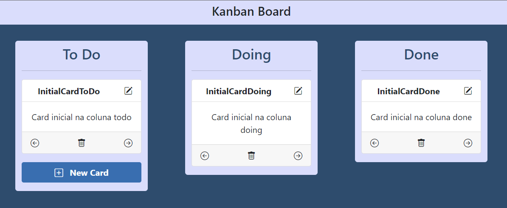

# Kanban board

## Content

<ul>
<li><a href="## About it">About it</a></li>
<li><a href="## Setting up">Setting Up</a></li>
<li><a href="## Loging in">Logging In</a></li>
<li><a href="## Kanban board">Kanban board</a></li>
</ul>
<hr>

## About it

Project of a Kanban board created using Angular 13 and Bootstrap 5.



<hr>

## Setting up

This project is using an API to validate an token using JWT and to store and manage the cards.

Follow this steps to set it up:
```
> cd BACK
> npm install
> npm run server
```
The server will be running on the port 5000.

To set up the angular server, follow this steps starting on the root folder (you should already have the Angular CLI installed on you computer):
```
> cd FRONT
> npm install
> ng serve
```
By default, the angular application should be running on the port 4200.

<hr>

## Loging in

This application was designed to start with a login page, to get the JWT Token. A Sign Up feature is not implemented yet, so to get it working, the following credentials must be used:
```
login: letscode
password: lets@123
```
Also, the application does not check if the token is already expired. So if you stay longer than 1 hour using it, you must reload the page to get a new token.

<hr>

## Kanban board

There are three columns: Todo, Doing and Done. Three setup cards is already created on the API, but you can click on Create Card to set a new card on the Todo list and edit it as you want.

To edit a card (edit content, delete it or change columns), just click on the icons inside each card.
